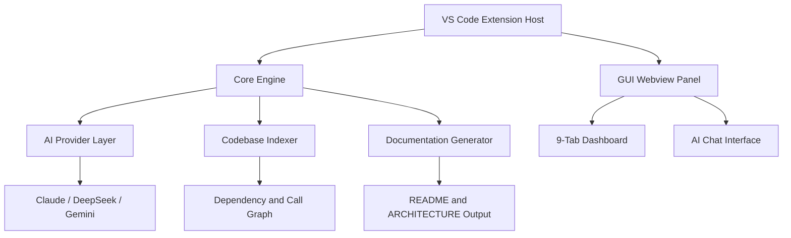

# Architecture

## Overview

Code Analyzer is an AI-powered VS Code extension that provides codebase intelligence directly inside the editor. It analyzes any project — local or remote — and surfaces architecture diagrams, dependency graphs, documentation generation, and multi-turn AI chat with full cross-file context. It supports three AI providers (Claude, DeepSeek, Gemini) with keys stored securely in VS Code's secrets vault.

## Module Structure

## Key Modules

| Module | Path | Responsibility |
|---|---|---|
| **VS Code Extension** | `extensions/vscode/` | Entry point; registers commands, manages webview panels, handles VS Code API lifecycle and secure secret storage |
| **Core Engine** | `core/` | Central logic layer; orchestrates indexing, symbol resolution, cross-file context building, and AI request routing |
| **GUI Webview** | `gui/` | React-based frontend rendered inside VS Code panels; hosts the 9-tab dashboard, AI chat, and diff previews |
| **Binary / CLI** | `binary/` | Standalone binary target; enables GitHub remote analysis and out-of-process heavy computation |
| **AI Provider Layer** | `core/` (provider adapters) | Abstracts Claude (Anthropic), DeepSeek, and Gemini (`@ai-sdk/google`) behind a unified interface; manages API keys via VS Code secrets vault |
| **Codebase Indexer** | `core/` (indexer) | Walks the file tree, parses symbols, builds the module import graph, detects dependency cycles, and computes git hotspots |
| **Documentation Generator** | `core/` (doc generator) | Produces README, inline JSDoc/TSDoc, and ARCHITECTURE.md; presents a diff to the user before writing to disk |
| **Dashboard Tabs** | `gui/` (dashboard) | Renders dependency graph, call graph, git hotspots, module coupling heatmap, symbol search, and AI insights across 9 tabs |

## Data Flow

1. **Activation** — The VS Code extension (`extensions/vscode/`) activates on command invocation or workspace open, registering all commands and instantiating the webview panel.
2. **Indexing** — The Core Engine (`core/`) walks the workspace file tree, parses source files, extracts symbols, and builds a module import graph with cycle detection.
3. **Context Assembly** — When a user opens AI Chat or requests an architecture overview, the Core Engine assembles cross-file context. `@filename` mentions inject specific file contents directly into the prompt payload.
4. **AI Dispatch** — The assembled context and user prompt are forwarded to the AI Provider Layer inside `core/`, which selects the configured provider (Claude, DeepSeek, or Gemini via `@ai-sdk/google`) and streams the response.
5. **Remote Analysis** — For GitHub URLs, the `binary/` module fetches and unpacks the repository out-of-process, feeds it through the same indexing pipeline, and returns results without requiring a local clone.
6. **Rendering** — Responses, diagrams, and graph data are sent to the GUI Webview (`gui/`) over the VS Code webview message bridge and rendered in the appropriate dashboard tab.
7. **Documentation Write-back** — Generated documentation (README, JSDoc, ARCHITECTURE.md) is shown as a diff inside the editor via the VS Code diff API; the user confirms before the Core Engine writes the file to disk.

## Design Decisions

1. **Monorepo with four TypeScript projects (`core`, `gui`, `extensions/vscode`, `binary`)** — Separating concerns into distinct `tsconfig.json` targets (visible in the root `package.json` `tsc:watch` scripts) allows the heavy indexing logic in `core/` to be reused by both the VS Code extension and the standalone `binary/` CLI, avoiding duplication and enabling independent type-checking and build caching.

2. **Webview-based GUI over native VS Code UI** — Hosting the 9-tab dashboard and AI chat in a React webview (`gui/`) gives full control over layout and interactivity (heatmaps, graph visualizations, diff previews) that native VS Code tree views and quick-pick menus cannot provide, at the cost of a message-passing bridge between the extension host and the webview.

3. **Pluggable AI provider abstraction with secure key storage** — Rather than hard-coding a single LLM, the AI Provider Layer in `core/` routes requests to whichever provider the user has configured, with API keys stored in VS Code's encrypted secrets vault rather than plain settings. This keeps credentials safe and makes adding future providers a localized change confined to the provider adapter layer.