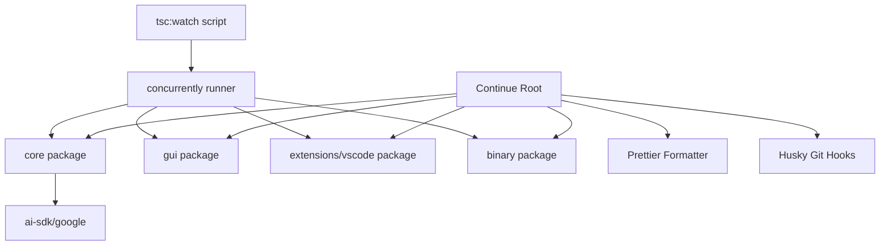

# Continue

Continue is an open-source AI coding assistant that integrates directly into your editor, enabling intelligent code completion, chat, and automation powered by large language models.

## Features

- **Multi-package monorepo** — Modular architecture split across `core`, `gui`, `extensions/vscode`, and `binary` packages
- **VS Code extension** — Deep IDE integration via `extensions/vscode` for inline suggestions and chat
- **Standalone binary** — Headless `binary` package for running Continue outside the editor
- **Google AI SDK support** — Built-in integration with `@ai-sdk/google` for Gemini model access
- **TypeScript throughout** — All packages are fully typed with per-package `tsconfig.json` configurations
- **Concurrent type-checking** — `tsc:watch` script monitors all packages simultaneously via `concurrently`
- **Automated formatting** — Prettier enforced across all `.js`, `.jsx`, `.ts`, `.tsx`, `.json`, `.css`, and `.md` files
- **Git hooks** — Pre-commit quality gates managed by Husky

## Installation

### Prerequisites

- [Node.js](https://nodejs.org/) v18 or later
- [npm](https://www.npmjs.com/) v9 or later

### Steps

1. **Clone the repository**

   ```bash
   git clone https://github.com/continuedev/continue.git
   cd continue
   ```

2. **Install root dependencies**

   ```bash
   npm install
   ```

3. **Install dependencies for each package**

   ```bash
   cd core && npm install && cd ..
   cd gui && npm install && cd ..
   cd extensions/vscode && npm install && cd ../..
   cd binary && npm install && cd ..
   ```

4. **Set up Git hooks**

   Husky hooks are installed automatically via the `prepare` script when you run `npm install` at the root. If needed, run manually:

   ```bash
   npm run prepare
   ```

## Usage

### Start type-checking all packages concurrently

Watch for TypeScript errors across `core`, `gui`, `extensions/vscode`, and `binary` simultaneously:

```bash
npm run tsc:watch
```

Each package is monitored in a separate labeled process:

| Label    | Package                  | Color   |
|----------|--------------------------|---------|
| `gui`    | `gui/tsconfig.json`      | Cyan    |
| `vscode` | `extensions/vscode/tsconfig.json` | Magenta |
| `core`   | `core/tsconfig.json`     | Yellow  |
| `binary` | `binary/tsconfig.json`   | Green   |

### Watch a single package

```bash
# Core only
npm run tsc:watch:core

# VS Code extension only
npm run tsc:watch:vscode

# GUI only
npm run tsc:watch:gui

# Binary only
npm run tsc:watch:binary
```

### Format the codebase

Check formatting across all supported file types:

```bash
npm run format:check
```

Apply formatting fixes:

```bash
npm run format
```

Prettier respects both `.gitignore` and `.prettierignore` when resolving files to format.

## Architecture



### Module Descriptions

- **`core`** — The heart of Continue. Contains the LLM integration logic, context providers, and shared business logic consumed by other packages. Integrates `@ai-sdk/google` for Gemini model access.
- **`gui`** — The front-end UI layer, providing the chat interface and inline suggestion panels rendered inside the editor sidebar.
- **`extensions/vscode`** — The VS Code extension entry point. Bridges the editor's extension API with the `core` and `gui` packages to deliver IDE-native features such as inline completions and the chat panel.
- **`binary`** — A standalone headless binary that runs Continue outside of any editor, useful for CI pipelines or server-side automation.
- **`tsc:watch` / `concurrently`** — Root-level developer tooling that runs all four per-package TypeScript watchers in parallel, with color-coded output for easy identification.
- **Prettier + Husky** — Code quality layer enforcing consistent formatting on every commit via pre-commit hooks.

## Contributing

1. **Fork** the repository and create a feature branch: `git checkout -b feat/your-feature`.
2. **Follow the code style** — run `npm run format:check` before committing and fix any issues with `npm run format`.
3. **Type-check your changes** — run `npm run tsc:watch` (or the relevant per-package variant) and resolve all TypeScript errors before opening a pull request.
4. **Commit conventions** — use clear, descriptive commit messages. Husky pre-commit hooks will enforce formatting automatically.
5. **Open a pull request** against the `main` branch with a description of what was changed and why.
6. **Issues** — bug reports and feature requests are welcome via the GitHub Issues tracker. Please include reproduction steps and your Node.js version when reporting bugs.