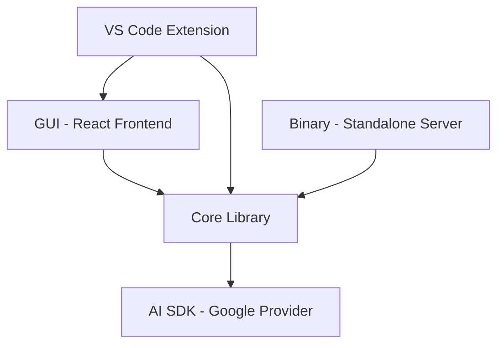

# Architecture

## Overview

Continue is an open-source AI coding assistant designed to integrate with code editors (primarily VS Code) to provide intelligent code completion, chat, and automation features. The system is composed of four main packages: a core logic library, a VS Code extension, a web-based GUI, and a standalone binary. These packages work together to deliver AI-assisted development workflows powered by configurable language model backends.

## Module Structure

## Key Modules

| Module | Path | Responsibility |
|---|---|---|
| **Core** | `core/` | Central business logic: LLM orchestration, context management, indexing, and shared types used by all other packages |
| **VS Code Extension** | `extensions/vscode/` | Editor integration layer; registers commands, handles editor events, bridges the GUI webview and Core |
| **GUI** | `gui/` | React-based chat and configuration UI rendered inside the VS Code webview panel |
| **Binary** | `binary/` | Standalone server/process entry point; allows Core to run outside of an editor extension context |
| **AI SDK Integration** | `package.json` → `@ai-sdk/google` | Provides the Google AI model provider adapter consumed by Core for LLM inference calls |
| **Build Tooling** | `package.json` scripts | Monorepo-level TypeScript watch compilation and formatting orchestrated via `concurrently` and `prettier` |

## Data Flow

1. **User Input** — The user types a message or triggers a command inside VS Code or the GUI (`gui/`).
2. **Extension Bridge** — The VS Code Extension (`extensions/vscode/`) receives the event and forwards it to the Core library via an internal message-passing or direct API call.
3. **Core Processing** — `core/` handles the request: retrieves relevant context (open files, codebase index, conversation history), constructs a prompt, and selects the appropriate LLM provider.
4. **LLM Inference** — Core calls the configured model backend (e.g., Google AI via `@ai-sdk/google`) with the assembled prompt and streams the response back.
5. **Response Routing** — The streamed response is passed back through Core to the VS Code Extension, which forwards it to the GUI webview for rendering.
6. **GUI Rendering** — The React GUI (`gui/`) displays the streamed response to the user in real time.
7. **Binary Path (alternative)** — When running headlessly, `binary/` acts as the server entry point, accepting requests and delegating to `core/` directly without the VS Code layer.

## Design Decisions

1. **Monorepo with Isolated TypeScript Projects** — Each package (`core`, `gui`, `extensions/vscode`, `binary`) has its own `tsconfig.json` and is type-checked independently via `tsc:watch:*` scripts. This enforces clear API boundaries between packages and prevents accidental cross-package coupling at the type level.

2. **Core as a Framework-Agnostic Library** — All LLM orchestration, context retrieval, and business logic lives in `core/` rather than inside the VS Code extension. This makes the logic reusable by both the VS Code extension and the standalone `binary/`, and simplifies future support for additional editors (e.g., JetBrains).

3. **AI SDK Abstraction for Model Providers** — Rather than calling LLM provider APIs directly, Continue uses the `@ai-sdk/google` adapter (and by convention, the broader Vercel AI SDK pattern). This decouples Core from any specific provider's HTTP interface, making it straightforward to swap or add model backends without changing orchestration logic.