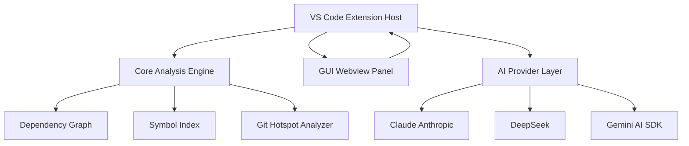

# Architecture

## Overview

Code Analyzer is an AI-powered VS Code extension that provides codebase intelligence directly inside the editor. It analyzes any project — local or remote — and surfaces architecture diagrams, dependency graphs, documentation generation, and multi-turn AI chat with full cross-file context. The system supports three AI providers (Claude, DeepSeek, Gemini) and presents results through a multi-tab dashboard UI embedded in VS Code.

## Module Structure

## Key Modules

| Module | Path | Responsibility |
|---|---|---|
| **VS Code Extension** | `extensions/vscode/` | Entry point, command registration, secrets vault for API keys, webview lifecycle management |
| **Core Analysis Engine** | `core/` | File indexing, symbol extraction, module graph construction, cycle detection, coupling heatmap |
| **GUI Webview** | `gui/` | 9-tab dashboard UI rendered inside VS Code webview panels, AI chat interface, diff previews |
| **Binary / CLI** | `binary/` | Standalone binary target for running analysis outside the extension host (e.g., GitHub remote analysis) |
| **AI Provider Layer** | `core/` (providers) | Abstraction over Claude, DeepSeek, and Gemini; routes prompts, streams responses, handles key auth |
| **Dependency Graph** | `core/` (graph) | Builds import/export graphs, detects circular dependencies, generates Mermaid output |
| **Documentation Generator** | `core/` (docs) | Produces README, JSDoc/TSDoc inline comments, and ARCHITECTURE.md; presents unified diff before writing |
| **GitHub Remote Analyzer** | `binary/` | Fetches and unpacks public GitHub repositories by URL without requiring a local clone |

## Data Flow

1. **Activation** — The VS Code extension activates on workspace open; `extensions/vscode/` registers commands and initializes the secrets vault for AI provider keys.
2. **Indexing** — `core/` scans the workspace file tree, extracts symbols, and builds a module import/export graph stored in memory.
3. **User Trigger** — The user opens the dashboard, runs a command (e.g., Explain Code, Architecture Overview), or sends a chat message via the `gui/` webview.
4. **Context Assembly** — `core/` assembles relevant file contents, symbol references, and graph data into a structured prompt context; `@filename` mentions inject specific files directly.
5. **AI Dispatch** — The AI Provider Layer selects the configured provider (Claude / DeepSeek / Gemini via `@ai-sdk/google`) and streams the prompt with assembled context.
6. **Response Rendering** — Streamed tokens are forwarded from `core/` back to `gui/` over the VS Code webview message bridge and rendered in the appropriate dashboard tab.
7. **Write-back (optional)** — For documentation generation, a diff is computed and displayed in `gui/`; on user confirmation, `extensions/vscode/` writes the output files to disk.
8. **Remote Analysis** — When a GitHub URL is provided, `binary/` fetches the repository, passes it through the same indexing and AI pipeline, and returns results to the webview.

## Design Decisions

1. **Monorepo with four isolated TypeScript projects (`core`, `gui`, `extensions/vscode`, `binary`)** — Each sub-project has its own `tsconfig.json` and is type-checked independently via `tsc:watch:*` scripts. This enforces strict boundary separation: the GUI cannot directly import Node.js APIs, and the core engine has no VS Code dependency, making it reusable by the binary target.

2. **Webview-based UI over native VS Code tree views** — The 9-tab dashboard (dependency graph, call graph, heatmap, symbol search, etc.) requires rich, interactive rendering that native VS Code contribution points cannot provide. A webview panel hosted in `gui/` gives full control over layout and visualization (e.g., Mermaid diagrams, graph canvases) at the cost of a message-passing bridge to the extension host.

3. **Secrets stored in VS Code's secure secrets vault** — AI provider API keys (Anthropic, DeepSeek, Gemini) are never written to disk or workspace settings. They are stored and retrieved exclusively through VS Code's `SecretStorage` API inside `extensions/vscode/`, preventing accidental key exposure in version-controlled config files.