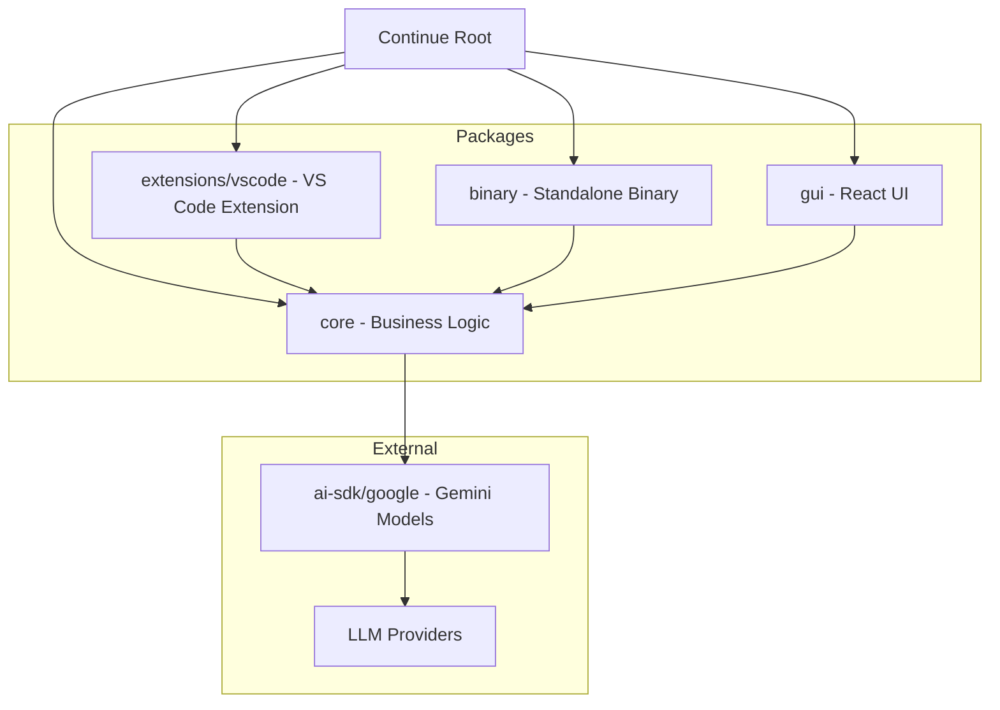

# Continue

Continue is an open-source AI coding assistant that integrates directly into your editor, enabling intelligent code completion, chat, and automation powered by large language models.

## Features

- **Multi-package monorepo** — Modular architecture split across `core`, `gui`, `extensions/vscode`, and `binary` packages
- **VS Code extension** — Deep IDE integration via `extensions/vscode` for inline suggestions and chat
- **Standalone binary** — Headless `binary` package for running Continue outside the editor
- **Google AI SDK support** — Built-in integration with `@ai-sdk/google` for Gemini model access
- **TypeScript throughout** — All packages are fully typed with per-package `tsconfig.json` configurations
- **Concurrent type-checking** — `tsc:watch` script monitors all packages simultaneously via `concurrently`
- **Automated formatting** — Prettier enforced across all `.js`, `.jsx`, `.ts`, `.tsx`, `.json`, `.css`, and `.md` files
- **Git hooks** — Pre-commit quality gates managed by Husky

## Installation

### Prerequisites

- [Node.js](https://nodejs.org/) v18 or later
- [npm](https://www.npmjs.com/) v9 or later

### Steps

1. **Clone the repository**

   ```bash
   git clone https://github.com/continuedev/continue.git
   cd continue
   ```

2. **Install root dependencies**

   ```bash
   npm install
   ```

3. **Install dependencies for each package**

   ```bash
   cd core && npm install && cd ..
   cd gui && npm install && cd ..
   cd extensions/vscode && npm install && cd ../..
   cd binary && npm install && cd ..
   ```

4. **Set up Git hooks**

   ```bash
   npm run prepare
   ```

### VS Code Extension (Development)

1. Open the repository root in VS Code
2. Press `F5` to launch the Extension Development Host
3. The Continue panel will appear in the Activity Bar

## Usage

### Start TypeScript watch mode (all packages)

```bash
npm run tsc:watch
```

This runs four concurrent watchers — `gui`, `vscode`, `core`, and `binary` — each using their respective `tsconfig.json`:

- `gui/tsconfig.json`
- `extensions/vscode/tsconfig.json`
- `core/tsconfig.json`
- `binary/tsconfig.json`

### Watch a single package

```bash
# Core only
npm run tsc:watch:core

# VS Code extension only
npm run tsc:watch:vscode

# GUI only
npm run tsc:watch:gui

# Binary only
npm run tsc:watch:binary
```

### Format all source files

```bash
npm run format
```

### Check formatting without writing

```bash
npm run format:check
```

## Architecture



### Module Descriptions

| Package | Path | Role |
|---|---|---|
| **core** | `core/` | Central business logic: LLM orchestration, context retrieval, prompt construction, and model provider integrations including `@ai-sdk/google` |
| **gui** | `gui/` | React-based chat and configuration UI, compiled and embedded into the VS Code webview |
| **extensions/vscode** | `extensions/vscode/` | VS Code extension host process; bridges editor events, inline completions, and commands to `core` |
| **binary** | `binary/` | Standalone Node.js binary that exposes Continue functionality outside of any editor environment |

## Contributing

1. **Fork** the repository and create a feature branch: `git checkout -b feat/your-feature`
2. **Install** all dependencies following the [Installation](#installation) steps above
3. **Make changes** — keep each package's concerns separate (`core` for logic, `gui` for UI, `extensions/vscode` for editor integration)
4. **Type-check** your changes: `npm run tsc:watch` (ensure zero errors across all packages)
5. **Format** your code: `npm run format`
6. **Commit** using a descriptive message and open a Pull Request against `main`
7. All PRs must pass formatting checks (`npm run format:check`) enforced by Husky pre-commit hooks

For larger changes, please open an issue first to discuss the proposed approach. See [docs.continue.dev](https://docs.continue.dev) for full developer documentation.