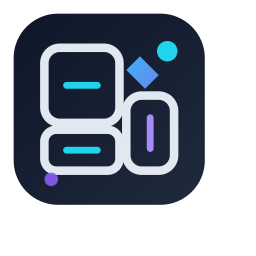

<div align="center">



# Code Analyzer

**AI-powered codebase intelligence for VS Code.**

Understand any project instantly — explanations, architecture diagrams, dependency graphs, and smart documentation, all inside your editor.

[](https://marketplace.visualstudio.com/items?itemName=nmaaalhawary.code-analyzer)
[](https://github.com/NmaaAlhawary/CodeAnalysis)
[](LICENSE.md)

<br/>

[**↓ Install Free**](https://marketplace.visualstudio.com/items?itemName=nmaaalhawary.code-analyzer) · [Docs](https://nmaaalhawary.github.io/CodeAnalysis/) · [Report Issue](https://github.com/NmaaAlhawary/CodeAnalysis/issues)

</div>

---

## ✦ What it does

Open a folder, index in 2 seconds, then ask — the AI has full cross-file context including your module graph.

| | Feature | Description |
|---|---|---|
| 💬 | **Persistent AI Chat** | Multi-turn conversation with full codebase context. Type `@filename` to inject any file. History persists across sessions. |
| 📊 | **9-Tab Dashboard** | Overview · File Tree · Dependency Graph · Call Graph · Git Hotspots · Git History · Module Coupling · Symbol Search · AI Insights |
| 🔍 | **Cycle Detection** | Tarjan's SCC algorithm highlights circular imports in red on your dependency graph |
| 🗺 | **Architecture Diagrams** | AI-generated Mermaid diagrams with automatic syntax fixing. Diagrams that actually render. |
| 📝 | **Auto Documentation** | Generate README.md, inline JSDoc/TSDoc, and ARCHITECTURE.md — all show a diff before writing |
| ⬡ | **GitHub Remote Analysis** | Paste any public GitHub URL. Analyzes via REST API — no git clone. 24-hour cache. |
| 🔗 | **Symbol Search** | Searchable table of every symbol — name, kind, file, line, exported flag, doc coverage |
| 🧠 | **Choose Your AI** | Claude, DeepSeek, or Gemini — switch anytime. Keys stored in VS Code's secure secrets vault. |

---

## Installation

**From the Marketplace** — search `Code Analyzer` in the Extensions panel (<kbd>⌘⇧X</kbd>) or run:

```bash
code --install-extension nmaaalhawary.code-analyzer
```

**From source:**

```bash
git clone https://github.com/NmaaAlhawary/CodeAnalysis.git
cd CodeAnalysis/vscode-code-analyzer
npm install
npm run package
code --install-extension code-analyzer-2.0.0.vsix
```

---

## Setup — 3 steps

**1 · Install the extension** *(see above)*

**2 · Get an AI API key** — the extension is free, you only pay for AI calls (usually pennies):

| Provider | Where to get a key | Notes |
|---|---|---|
| ✦ **Claude** | [console.anthropic.com](https://console.anthropic.com) | Best quality |
| 🚀 **DeepSeek** | [platform.deepseek.com](https://platform.deepseek.com) | Fast & affordable |
| 🌐 **Gemini** | [aistudio.google.com](https://aistudio.google.com) | Free tier available |

**3 · Configure and go** — open the Command Palette and run:

```
Code Analyzer: Configure AI Provider
```

Pick your provider, paste your key. Then open any project and press <kbd>⌘⇧C</kbd> to start chatting with your codebase.

---

## Usage

| Action | Shortcut |
|---|---|
| Open AI Chat | <kbd>⌘⇧C</kbd> |
| Open Dashboard | <kbd>⌘⇧D</kbd> |
| Explain selected code | <kbd>⌘⇧E</kbd> |
| Generate workspace diagram | <kbd>⌘⇧G</kbd> |
| Workspace tools | <kbd>⌘⇧A</kbd> |
| Restart / reload window | <kbd>⌘⇧R</kbd> |
| Explain file / generate inline docs | Right-click in editor |
| All commands | <kbd>⌘⇧P</kbd> → `Code Analyzer` |

---

## Dashboard Tabs

| Tab | What it shows |
|---|---|
| Overview | Project health score, file stats, language breakdown |
| File Tree | Clickable file tree with edit-frequency heat overlay |
| Dependency Graph | Module dependency graph with cycle detection (Tarjan SCC) |
| Call Graph | Function-to-function call graph for any file |
| Git Hotspots | Most-edited files, churn vs size scatter plot |
| Git History | Commit frequency, author contributions |
| Module Coupling | Cross-module import heatmap |
| Symbol Search | Search every symbol by name, kind, or file |
| AI Insights | Cached AI narrative: project summary, architectural concerns, refactoring targets |

---

## How it compares

| Feature | Code Analyzer | CodeSee | Sourcegraph |
|---|:---:|:---:|:---:|
| Free & open source | ✅ | ❌ | ❌ |
| Works inside VS Code | ✅ | ~ | ✅ |
| Full cross-file AI context | ✅ | ✅ | ✅ |
| AI chat with streaming | ✅ | ~ | ✅ |
| Architecture diagrams | ✅ | ✅ | ~ |
| Cycle detection | ✅ | ❌ | ❌ |
| Auto doc generation | ✅ | ❌ | ❌ |
| GitHub remote analysis | ✅ | ❌ | ✅ |
| Your code stays local | ✅ | ❌ | ❌ |

---

## Configuration

| Setting | Default | Description |
|---|---|---|
| `codeAnalyzer.aiProvider` | `claude` | AI provider: `claude`, `deepseek`, or `gemini` |
| `codeAnalyzer.claudeModel` | `claude-sonnet-4-6` | Claude model name |
| `codeAnalyzer.geminiModel` | `gemini-2.5-flash` | Gemini model name |
| `codeAnalyzer.deepseekModel` | `deepseek-chat` | DeepSeek model name |
| `codeAnalyzer.maxContextTokens` | `24000` | Max tokens sent per request |
| `codeAnalyzer.enableAutoIndex` | `true` | Auto-index workspace on startup |
| `codeAnalyzer.enableStreaming` | `true` | Stream AI responses token by token |
| `codeAnalyzer.docStyle` | `tsdoc` | Doc style: `tsdoc`, `jsdoc`, or `docstring` |
| `codeAnalyzer.enableCodeLens` | `true` | Show ✨ Explain lenses above functions |

---

## Requirements

- VS Code 1.90+
- An API key for at least one AI provider (Claude, DeepSeek, or Gemini)

---

<div align="center">

MIT © 2025 [NmaaAlhawary](https://github.com/NmaaAlhawary)

</div>
